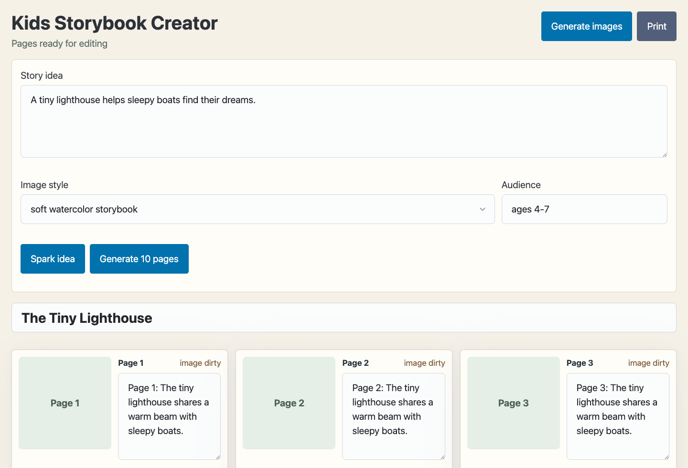

<!--
Generated from kit-meta.json by scripts/demo-kit-standard.mjs.
Update kit-meta.json or capability.yml, then rerun the generator instead of hand-editing generated README sections.
-->

# Kids Storybook Creator

Local-first AI app Kit for generating and editing a simple illustrated children's storybook.



**Tags:** `web-ui` `llama.cpp` `stable-diffusion` `image-generation` `local-ai` `react` `vite` `typescript` `bun`

## What It Does

- Turns a story idea into a 10-page story arc.
- Uses a local language model for story text and a local image model for page art.
- Serves a browser UI for editing pages and printing the final storybook.

## Technologies

- CapaKit HTTP workload
- Bundled llama.cpp AI app Kit dependency
- Bundled stable-diffusion.cpp AI app Kit dependency
- React
- Vite
- TypeScript
- Bun

## App Kit Info

```text
AI app Kit: kids-storybook-creator

Exposes
- Public path: /
  Protocols:
    - Protocol: http
      Path: /http

Requires
Secrets:
No secrets declared.

Host mounts:
- models [read_write]
  Usage: Local model cache for bundled llama.cpp and stable-diffusion.cpp dependencies

Options:
- gpu [enum, default=metal, values=none|metal]: Local GPU acceleration mode for bundled local model dependencies.
- image_backend [enum, default=auto, values=auto|cpu|metal]: Backend passed through to the stable-diffusion.cpp dependency.
- image_model [string, default=turingevo/tiny-sd-gguf:segmind_tiny-sd-q4_K]: Diffusion model spec used for page images.
- image_style [string, default=soft watercolor storybook]: Default visual style used for page image prompts.
- llama_context_size [number, default=8192]: Context size passed through to the bundled llama.cpp dependency.
- story_model [string, default=ggml-org/gemma-3-270m-it-GGUF:Q8_0]: Local GGUF/Hugging Face model spec used for story planning and text.

External services
No external services declared.

AI app Kit dependencies
- imagegen: repo package https://github.com/capakit/stable-diffusion-local-kit (default bundled AI app Kit)
  Options passed:
  - backend <- option image_backend (default: auto)
  - default_model <- option image_model (default: turingevo/tiny-sd-gguf:segmind_tiny-sd-q4_K)
  Mounts passed:
  - models <- models (Local model cache for bundled llama.cpp and stable-diffusion.cpp dependencies)
- llama: repo package https://github.com/capakit/llama-cpp-local-kit (default bundled AI app Kit)
  Options passed:
  - context_size <- option llama_context_size (default: 8192)
  - default_model <- option story_model (default: ggml-org/gemma-3-270m-it-GGUF:Q8_0)
  - gpu <- option gpu (default: metal)
  Mounts passed:
  - models <- models (Local model cache for bundled llama.cpp and stable-diffusion.cpp dependencies)

Commands
- Run:
  capakit run https://github.com/capakit/kids-storybook-creator-demo-kit \
    --mount models=~/.capakit/models
- Test:
  capakit test .
```

## Run

```sh
capakit run https://github.com/capakit/kids-storybook-creator-demo-kit \
--mount models=~/.capakit/models
```

## Test

```sh
capakit test .
```

## Security

Vault secrets are user-provided secrets available only to trusted integrations such as secure exit nodes. Kit secrets are Kit-local secrets that can be exposed to code workloads.

## About CapaKit

CapaKit runs AI app Kits locally with isolated workloads, explicit mounts, and agent-friendly commands. Learn more at https://capakit.com.

More AI app Kits: https://github.com/capakit/apps
